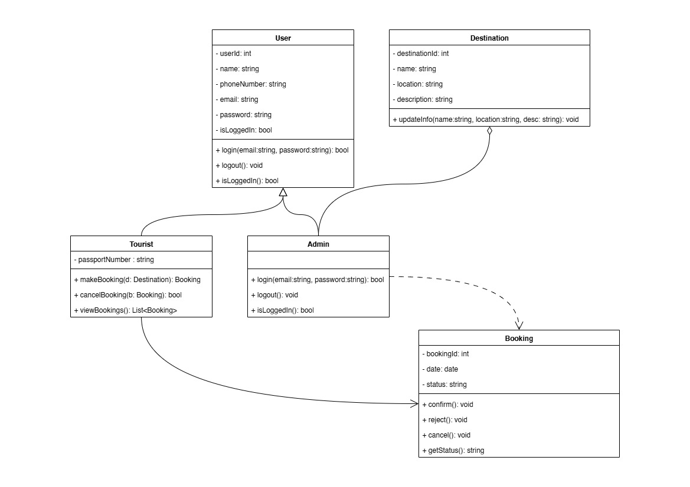

# 🌊 SplashGo!
Aplikasi SplashGo! adalah sistem digital untuk mengelola reservasi, data wisatawan, dan operasional destinasi laut secara efisien dan terintegrasi.

## 👤 Kelompok SplashGo!
- Anggota 1: Muhammad Haidar Syaafi' - 23/521614/TK/57545
- Anggota 2: Davana Nico Fadla - 23/522338/TK/57649
- Anggota 3: Indah Nurrohmah - 23/523051/TK/57801

## 🗄️ Class Diagram
Diagram Kelas UML untuk Travel Booking System ini menggambarkan struktur yang terorganisir dan jelas, dengan pembagian peran antara pengguna (User), turis (Tourist), dan admin (Admin). Pewarisan dari kelas User ke Tourist dan Admin mencerminkan prinsip OOP dengan baik, memungkinkan fungsionalitas umum seperti login dan logout digunakan bersama. Tourist diberi kemampuan membuat, membatalkan, dan melihat Booking, sementara Admin memiliki kewenangan mengelola Destination dan memverifikasi Booking, memperlihatkan pemisahan tanggung jawab yang tepat. Hubungan langsung antara Booking dan Destination mendukung fungsionalitas inti sistem, yaitu pemesanan destinasi wisata. Dengan atribut dan metode yang lengkap di setiap kelas, diagram ini mencerminkan desain sistem yang logis dan siap diimplementasikan.

